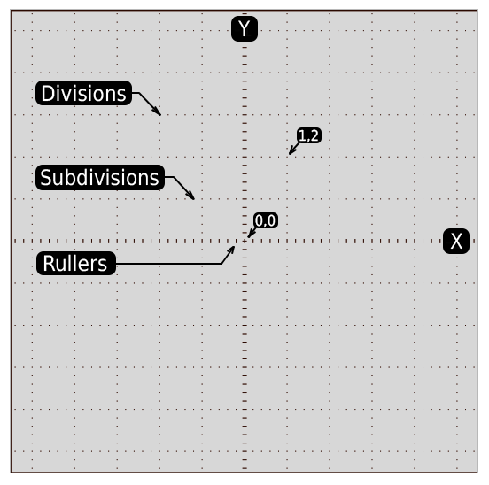

# VARP Oscilloscope
_Documentation for Untiy asset_ 

## Getting Stated

 VARP Oscilloscope are small, easy to use Unity asset, that you can use to record and analyze values modifyed by script, physcis or animation in real time. The oscilloscopes have four-channels but can be extended without proggraming.
In addition to the list of general features, this section covers the following topics:

- How to add asset to your project
- How to add extended functions
- How to perform a brief functional check
- How to compensate probes
- How to use the self calibration routine
- How to match your probe attenuation factor

## Features

- Single time base digital real-time oscilloscope
- Every frame or every fixed update sample rate<sup>1</sup> and 1000<sup>2</sup> point record lenght for each channel. 
- Four<sup>3</sup> independed recording channels.
- One additional external channel can be used for trigger sampling 
- Each buffer is aray of floating point values
- Each channel has it's own color tag.
- Screen 550x550pixels and 11x11 divisions grid<sup>4</sup> 
- Four automated measurements (min,max,peak,average)
- Autoset for quick setup
- Cursors with readout
- Custom markers OSD.

<sup>1</sup> The sampling rate is fully configurable and can be replaced to other time steps for example 1second.

<sup>2</sup> Can be modifyed to another size.

<sup>4</sup> Can be modifyed to another channels quantity.

<sup>3</sup> Can be modifyed to another dimentions.

## Additional Features 

- Does not require custom Unity GUI tools and learing.
- Fully configurable with script for different measurements. 
- Human friendly attenuation gain and time per division values. 

## Installation

Drop asset folder inside Assets/Plugins folder. After that you can instantiate prefab Oscilloscope in the sceene of your project. Now you can write your own script to control the oscilloscope with your game events or data.

## Basic Concepts

To use your oscilloscope effectively, you must understand the
following basic concepts:

- Triggering
- Acquiring data
- Scaling and positioning waveforms
- Measuring waveforms
- Setting Up the oscilloscope

The figure below shows a block diagram of the various functions of
an oscilloscope and their relationship to each other.


**GameValue** 

_Any variable or class member can be captured by pushing it to the probe every frame or only when it was changed. As alternative the value can be pulled by lambda function assigned to the probe. Before recording the value should be converted to floating point type._

**OscProbe** 

_Container of sample and configuration settings for the channel or trigger. Avery time when the probe connected to the oscilloscope channel, the values will be copyied to the channel and to trigger (if this channel connected to trigger)._

**OscChannel** 

_This class contains data for data recording and rendering it on the screen. Every time when probe coonected to the channel, the channel reads settings from probe._

**OscBuffer** 

_The buffer for recorded samples._

**OscGrid** 

_Rendering of grid on the screen._

**OscRenderer** 

_Renderer of waveforms._

**OscTrigger** 

_Class which monitoring one of the channels and can be used to the start/stop acquiring data. Every time when trigger connected to channel, the trigger reads the configuration falues from channel._

**Oscilloscope** 

_Main code for the oscilloscope._

## Understanding Grid

The grid has divisions, subdivisions and rullers. Center of screen has coordinate 0,0. Horizontal axis X, and vertical axis Y has the ruller bar in the center of screen.



## Channel Names

The cnannels named CH1,CH2,CH3,CH4 can be used for record samples and draw oscillogram on screen. Additional channel EXT can be used only for triggering recording samples. The channel's name will be displayed on sceen display and can be used as argumen of functions.

The enum value OscChannel.Name has the list of  default names. 

| Value | Value Name | Comment |
|------------|-------|---------|
| 0 | EXT | External channel |
| 1 | CH1 | Channel 1 |
| 2 | CH2 | Channel 2 |
| 3 | CH3 | Channel 2 |
| 4 | CH4 | Channel 4 |
| 5 | CH5 | Channel 5<sup>1</sup> |
| 6 | CH6 | Channel 6<sup>1</sup> |
| 7 | CH7 | Channel 7<sup>1</sup> |
| 8 | CH8 | Channel 8<sup>1</sup> |

<sup>1</sup> _Reserved for extension_


## Probe Names

The name of probe in just a string value will be displayed on scree to inform user about which probe connected to this or that channel.


## OsdProbe

Lets create simple probe and connect it to oscilloscope channel A.

```C#
var characterVelocityProbe = new OscProbe("CharacterVelocity");
Oscilloscope.I.ActivateProbe(OscChannel.Name.CH1, characterVelocityProbe);
```

### Push Value to Probe

As probe created we can push value to the probe with setting the sample field.

```C#
characterVelocityProbe.sample = rigidbody.velocity.magnitude;
```

### Pull Value by Probe

Alternative way to read values is to assign the lambda method to the deligate of probe.

```C#
oscEvents.readSample = () => { return rigidbody.velocity.magnitude };
```

## Render Probe Markers 

Each probe can display horizontal markers with short text. 

```C#
oscLastDifficultyForce.postRender = (OscRenderer renderer, OscChannel channel) =>
{
    var x = 4f; // grid divisions
    channel.DrawHorizMarker(renderer, "-2", x, -2f);
    channel.DrawHorizMarker(renderer, "-1", x, -1f);
    channel.DrawHorizMarker(renderer, " 0", x, 0f);
    channel.DrawHorizMarker(renderer, "+1", x, 1f);
    channel.DrawHorizMarker(renderer, "+2", x, 2f);
};
```


### Probe Fields

| Type | Field | Info |
|---:|:----|:-----|
| readonly string | name | Probe name will be displayed on screen |
| float | position | Change vertical position of this diagram (divisions) |
| bool | autoGain | Audoset best gain for this probe |
| int | autoGainDivisions | Audoset gain will try to fit diagram to X divisions |
| OscTrigger.Mode | triggerMode | Trigger mode |
| float | triggerLevel | Trigger threshold |
| float | sample | Curent sample value |

### Probe Delegates

| Type | Field | Info |
|---:|:----|:-----|
| PostRenderDelegate | postRender |	Render additional markers |
| ReadSampleDelegate | readSample | Read sample from this probe	 |

