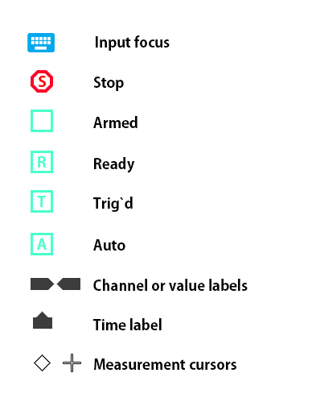

# VARP Oscilloscope
_Documentation for Unity asset_ 

## Getting Started

 VARP Oscilloscope is a small, easy to use Unity asset that you can use to record and analyze values modified by script, physics or animation in real time. The oscilloscopes have 4 channels but can be extended to 8 without additional programming.
In addition to the list of general features, this section covers the following topics:

- How to add asset to your project.
- How to add initialize the oscilloscope from your code.
- How to push or pull values to the oscilloscope probes.
- How to adjust probe magnitude attenuation factor.
- How to adjust trigger settings and horizontal scale value.

## Features

- Single time base digital real-time oscilloscope.
- Every frame or every fixed update sample rate<sup>1</sup> and 1024<sup>2</sup> point record length for each channel. 
- Screen 550x550 pixels and 11x11 divisions grid<sup>4</sup>.
- Four<sup>3</sup> independent recording channels.
- Any channel can be used as trigger source. 
- Each channel has buffer is array of Vector3 values.
- Each channel has its own color tag.
- Four automated measurements (min, max, peak, average).
- Custom labels OSD.
- Alternative 'Logic' rendering for integer values as a logic analyzer.
- Autoset for quick setup<sup>5</sup>.
- Cursors with readout<sup>5</sup>.

<sup>1</sup> _The sampling rate is fully configurable and can be replaced to other time steps._

<sup>2</sup> _Can be modified to another size._

<sup>3</sup> _Can be modified to another channels quantity._

<sup>4</sup> _Can be modified to another dimensions._

<sup>5</sup> _Not yet implemented._

## Additional Features 

- Does not require custom Unity GUI tools and easy to learn.
- Fully configurable with script for different measurements. 
- Human friendly attenuation gain and time per division values. 

## Screenshot

The asset is in development so the actual screenshot can have differences.


## Adding to your project

Copy VARP folder inside Assets/Plugins folder. After that you can instantiate prefab Oscilloscope in the scene of your project. Now you can write your own script to control the oscilloscope with your game events or data.

To activate/deactivate oscilloscope use ` key or property _IsVisible_.

```C#
oscilloscope.gui.IsVisible = true;  // Make visible
oscilloscope.gui.IsVisible = false; // Make invisible
```

To deactivate or activate input shortcuts use property _IsInFocus_. The state of keyboard (enabled/disabled) indicated by icon on the screen.

```C#
oscilloscope.gui.IsInFocus = true;  // Enable keybord shortcuts
oscilloscope.gui.IsInFocus = false; // Disable keyboard
```

## Basic Concepts

To use your oscilloscope effectively, you must understand the following basic concepts:

- Triggering.
- Acquiring data.
- Scaling and positioning waveforms.
- Measuring waveforms.
- Setting up the oscilloscope.

The figure below shows a block diagram of the various functions of
an oscilloscope and their relationship to each other.


**GameValue** _Any variable or class member can be captured by pushing it to the probe every frame or only when it was changed. As alternative the value can be pulled by lambda function assigned to the probe. Before recording the value should be converted to floating point, Vector2 or Vector3 types._

**OscProbe** _Container of configuration settings for the channel or trigger. Every time when the probe is connected to the channel, the values will be copied to the channel and to trigger (if this channel connected to trigger)._

**OscChannel** _This class contains data for data recording and rendering it on the screen._

**OscGrid** _Rendering the grid on the screen._

**OscRenderer** _Renderer waveforms or texts on screen._

**OscTrigger** _Class which is monitoring one of the channels and can be used to the start/stop acquiring data. Every time when trigger is connected to channel, the trigger reads the configuration values from it._

**Oscilloscope** _Main oscilloscope's code._

## Understanding Grid

The grid has divisions, subdivisions and rulers. Center of the screen has coordinate 0,0. Horizontal axis X, and vertical axis Y have the ruler bar in the center of screen.


## Channel Names

Access to each channel by script require to provide as argument channel's name C1, C2, ..., C8. The enum value OscChannel.Name has the list of default names. 

| Value | Value Name | Comment               |
|-------|------------|-----------------------|
| 0     | C1         | Channel 1             |
| 1     | C2         | Channel 2             |
| 2     | C3         | Channel 2             |
| 3     | C4         | Channel 4             |
| 4     | C5         | Channel 5<sup>1</sup> |
| 5     | C6         | Channel 6<sup>1</sup> |
| 6     | C7         | Channel 7<sup>1</sup> |
| 7     | C8         | Channel 8<sup>1</sup> |

<sup>1</sup> _Reserved for extension_

Additionaly the name of channel will be displayed on screen as the label. The label has horizontal arrow to mark channel's origin (0 value).


In cases when origin is outside of screen the label will rendered at the screen edge.

## Class OscSettings

This class based on ScriptabbleObject, can be used to create asset with oscilloscope's configuration settings.

| Type | Field             | Info                                                        |
|------|-------------------|-------------------------------------------------------------|
| int  | pixelsPerDivision | How many pixels in single division (recommend 10,20,30,...) |
| int  | divisionsX        | Horizontal divisions number (recommend odd value)           |
| int  | divisionsY        | Vertical divisions number (recommend odd value)             |
| int  | subdivisions      | Subdivisions in the division (recommend 5 or 10)            |
| bool | drawGrid          | Draw grid lines                                             |
| bool | drawRullerX       | Draw horizontal ruler in center                             |
| bool | drawRullerY       | Draw vertical ruler in center                               |

## Class OsdGrid

Changing the grid view by script.

```C#
oscilloscope.grid.DrawGrid = true;    // Draw grid cells
oscilloscope.grid.DrawRullerX = true; // Draw horizontal ruler
oscilloscope.grid.DrawRullerY = true; // Draw vertical ruler
```

## Class OsdProbe

### Probe Names

The name of probe in just a string value will be displayed on screen to inform user about which probe is connected to this or that channel.

### Probe Instantiating

Lets create simple probe and connect it to oscilloscope channel A.

```C#
// Create probe
var probe = new OscProbe("CharacterVelocity");
// Plug to the channel
oscilloscope.GetChannel(OscChannel.Name.C1).Plug(probe);
// Remove probe from channel (disable channel)
oscilloscope.GetChannel(OscChannel.Name.C1).Unplug();
```

### Probe Parameters

```C#
probe.Gain = 2f;                              // To set gain value V/
probe.position = -5;                          // To adjust vertical position (zero level of oscillogram)
probe.autoGain = true;                        // To enable auto gain feature
probe.autoGainDivisions = 2;                  // Request 2 divisions for peak to peak oscillogram
probe.style = OscProbe.Style.Logic;           // To change rendering style (Default, Logic)
// To set trigger's values (will be applied after tigger will be connected to channel)
probe.triggerMode = OscTrigger.Mode.Normal;   // Trigger's normal mode
probe.triggerMode = OscTrigger.Mode.Auto;     // Trigger's auto mode
probe.triggerMode = OscTrigger.Mode.Single;   // Trigger's single mode
probe.triggerEdge = OscTrigger.Edge.Rising;   // Trigger's rising edge detection
probe.triggerEdge = OscTrigger.Edge.Falling;  // Trigger's failing edge detection
probe.triggerLevel = 0.5f;                    // Trigger's edge detection threshold
```

### Push Value to Probe

As probe created we can push value to the probe with various of methods (listed below) or you can directly change the _sample_ field.

```C#
// Direct access to sample
probe.sample.x = Time.time;
probe.sample = transform.position;
// Write floating point value to probe
probe.Log(rigidbody.velocity.magnitude);
// Write integer value to probe
probe.Log((int)Time.time);
// Write bool value to probe
probe.Log(Time.time > 10f);
// Write Vector2 to probe
probe.Log(transform.achoredPosition);
probe.Log(x,y);
// Write Vector3 value to probe
probe.Log(rigidbody.velocity);
probe.Log(x,y,z);
// Write color value to probe
probe.Log(text.color);
```

### Pull Value by Probe

Alternative way to read values is to assign the lambda method to the delegate of probe.

```C#
characterVelocityProbe.readSample = (OscProbe probe) =>
{
   probe.sample = rigidbody.velocity;
}; 
```

### Render Probe Markers 

Each probe can display horizontal markers with short text. 

```C#
oscLastDifficultyForce.postRender = (OscRenderer renderer, OscChannel channel) =>
{
    channel.DrawLabel(renderer, "-2", -2f);
    channel.DrawLabel(renderer, "-1", -1f);
    channel.DrawLabel(renderer, " 0", 0f);
    channel.DrawLabel(renderer, "+1", 1f);
    channel.DrawLabel(renderer, "+2", 2f);
};
```


### Default Probes

Three predefined probe types available.

- **OscProbe.Null** Default probe usualy used for disabling a channel. 
- **OscSineProbe.Default** Default probe with 10Hz 1V sine wave form. 
- **OscSquareProbe.Default** Default probe with 10Hz 1V square form. 

## Class OscChannel

When probe is connected to channel, all values from this probe will be copied to the channel. Now we can manipulate by channel's values directly.

```C#
var channel = oscilloscope.GetChannel(OscChannel.Name.C1);
channel.Gain = 2f;                            // To set gain (Volts per Div) 
channel.GainPlus();                           // Increase gain
channel.GainMinus();                          // Decrease gain
channel.Position = 1f;                        // Vertical position of channel (Divisions)
channel.AutoGain = true;                      // Enable auto gain
channel.autoDivisions = 2f;                   // Auto gain division number
channel.Decoupling = true;                    // AC mode
channel.Decoupling = false;                   // DC mode
channel.Style = Style.Default;                // Render standart diagramm
channel.Style = Style.Logic;                  // Render logic analyzer diagram
 ```
   
## Class OscTrigger

The trigger determines when the oscilloscope starts to acquire data
and display a waveform. When a trigger is set up properly, it can
convert unstable displays or blank screens into meaningful
waveforms.

### Trigger Source

You can derive your trigger source from any channel. To select trigger source use method _SetChannel_.

```C#
var trigger = oscilloscope.trigger;
trigger.SetChannel(OscChannel.Name.C1);
```

After method _SetChannel_ the settings from the channel will be applied for trigger. After that the settings can be adjusted by next methods.

```C#
oscilloscope.trigger.SecondsDivision = 1f;   // set 1 second per division
oscilloscope.trigger.SecondsDivisionPlus();  // increase second per division value
oscilloscope.trigger.SecondsDivisionMinus(); // decrease second per division value
oscilloscope.trigger.Position = 1f;          // chanel horizontal position 1 division after trigger
oscilloscope.trigger.Level = 1f;             // set threshold value for trigger
```

When channel records Vector3 or Vecto2 data, the trigger reading only X component of the vector. To alternate this behaviour can be used _readTriggerSample_ delegate.

```C#
probe.readTriggerSample = (OscCnammel ch) => ch.sample.magntude; // use vector's magnitude as the trigger's source
```

 
### Modes

There are three trigger mode available Auto, Normal, Single. To set trigger mode use method _SetMode_

```C#
oscilloscope.trigger.SetMode(Mode.Auto); // start capturing
```

- **Auto.** This trigger mode allows the oscilloscope to acquire a
waveform even when it does not detect a trigger condition. If no
trigger condition occurs while the oscilloscope waits for a specific
period (as determined by the time-base setting), it will force itself to
trigger.

- **Normal.** The Normal mode allows the oscilloscope to acquire a
waveform only when it is triggered. If no trigger occurs, the
oscilloscope will not acquire a new waveform, and the previous
waveform, if any, will remain on the display.

- **Single** The Single mode allows the oscilloscope to acquire one waveform each time you call ForceTrigger method, and the trigger condition is detected.

### Edge Detection

The trigger compares the channel value with trigger's level value and produces starting data acquiring depend on Edge detection mode. The picture below explain difference of Edge modes.


The method _AutoSetLevel_ will set the trigger's level to the vertical midpoint
between the peaks of signal at the trigger's source.

```C#
oscilloscope.trigger.AutoSetLevel();  
```

### Stopping acquiring waveform data 

While acquisition is running, the waveform display is live. Stopping the acquisition freezes the display. In either
mode, the waveform display can be scaled or positioned with the vertical and horizontal controls.

```C#
oscilloscope.trigger.Pause = true;   // stop acquiring
oscilloscope.trigger.Pause = false;  // run acquiring
```

### Single Mode

Starts an acquisition regardless of an adequate trigger signal. This button has no effect if the acquisition is already stopped.

```C#
oscilloscope.trigger.ForceTrigger(); // start capturing
```

### Time Labels

The time label will be rendered below the screen.  Each label has unique id and calling the _AddTimeLabel_ method with the same index will override previously defined label.  

```C#
oscilloscope.trigger.AddTimeLabel(0, "T1", Color.red); // add time label at the current time
```


## Taking Measurements

**TODO**

## Appendix

### Keyboard Shorcuts

| Keys                 | Functions |
|:--------------------:|--|
| `                    | _Enable, Disable oscilloscope GUI. Also used for activate input focus_  |
| 1 to 8               | _Select current channel_ |
| 0                    | _Select trigger_ |
| SHIFT+1 to SHIFT+8   | _Activate channel for trigger's source_ |
| Pause                | _Pause/Unpause the data acquiring_ |
| S                    | _Force start acquiring_ |
| G                    | _Modify grid style_ |
| **Selected Channel** | | 
| +, -                 | _Adjust gain value_ |
| Up, Down             | _Adjust verical position_ |
| C                    | _Adjust coupling settigs_ |
| A                    | _Enable/Disable auto gain mode_ |
| V                    | _Alternate view style_ |
| **Selected Trigger** | |
| E                    | __Alternate edge detection mode_ |
| M                    | __Alternate trigger mode_ |
| +, -                 | _Adjust time scale value_ |
| Left, Right          | _Adjust horizontal position_ |

### Icons legends



## Donation

If this project help you reduce time to develop, you can give me a cup of coffee :)

[](valery.hww@gmail.com)
