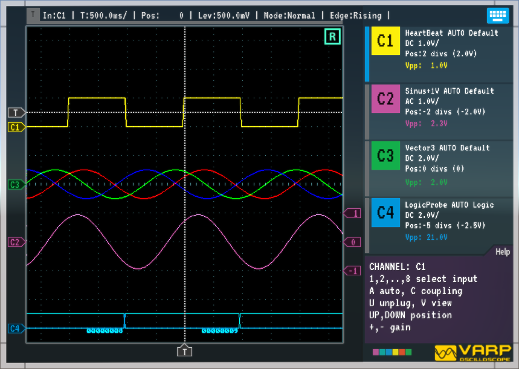
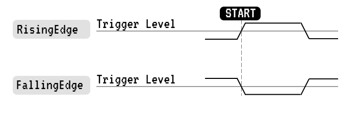

# VARP Oscilloscope
_Documentation for Untiy asset_ 

## Getting Stated

 VARP Oscilloscope are small, easy to use Unity asset, that you can use to record and analyze values modifyed by script, physcis or animation in real time. The oscilloscopes have four-channels but can be extended to 8 without additional proggraming.
In addition to the list of general features, this section covers the following topics:

- How to add asset to your project
- How to add initialize the oscilloscope from your code
- How to push or pull values to the oscilloscope probes
- How to ajust probe magnitude attenuation factor
- How to ajust trigger settings and horizontal scale value

## Features

- Single time base digital real-time oscilloscope
- Every frame or every fixed update sample rate<sup>1</sup> and 1024<sup>2</sup> point record lenght for each channel. 
- Four<sup>3</sup> independed recording channels.
- One of channels can be used for trigger acquiring 
- Each buffer is aray of Vector3 values
- Each channel has it's own color tag.
- Screen 550x550pixels and 11x11 divisions grid<sup>4</sup>.
- Four automated measurements (min,max,peak,average)
- Custom labels OSD.
- Alternative 'Logic' rendering for integer values as a logic analyzer.
- Cursors with readout<sup>5</sup>
- Autoset for quick setup<sup>5</sup>

<sup>1</sup> _The sampling rate is fully configurable and can be replaced to other time steps._

<sup>2</sup> _Can be modifyed to another size._

<sup>3</sup> _Can be modifyed to another channels quantity._

<sup>4</sup> _Can be modifyed to another dimentions and ._

<sup>5</sup> _Not yet implemented._

## Additional Features 

- Does not require custom Unity GUI tools and learing it.
- Fully configurable with script for different measurements. 
- Human friendly attenuation gain and time per division values. 

## Screenshoot

The asset is in development so the actual screenshot can have differences.



## Installation

Drop asset folder inside Assets/Plugins folder. After that you can instantiate prefab Oscilloscope in the sceene of your project. Now you can write your own script to control the oscilloscope with your game events or data.

## Basic Concepts

To use your oscilloscope effectively, you must understand the
following basic concepts:

- Triggering
- Acquiring data
- Scaling and positioning waveforms
- Measuring waveforms
- Setting Up the oscilloscope

The figure below shows a block diagram of the various functions of
an oscilloscope and their relationship to each other.


**GameValue** _Any variable or class member can be captured by pushing it to the probe every frame or only when it was changed. As alternative the value can be pulled by lambda function assigned to the probe. Before recording the value should be converted to floating point type._

**OscProbe** _Container of sample and configuration settings for the channel or trigger. Avery time when the probe connected to the oscilloscope channel, the values will be copyied to the channel and to trigger (if this channel connected to trigger)._

**OscChannel** _This class contains data for data recording and rendering it on the screen. Every time when probe coonected to the channel, the channel reads settings from probe._

**OscGrid** _Rendering of grid on the screen._

**OscRenderer** _Renderer of waveforms._

**OscTrigger** _Class which monitoring one of the channels and can be used to the start/stop acquiring data. Every time when trigger connected to channel, the trigger reads the configuration falues from channel._

**Oscilloscope** _Main code for the oscilloscope._

## Understanding Grid

The grid has divisions, subdivisions and rullers. Center of screen has coordinate 0,0. Horizontal axis X, and vertical axis Y has the ruller bar in the center of screen.


## Channel Names

The cnannels named C1,C2,C3,C4 can be used for record samples and draw oscillogram on screen. The channel's name will be displayed on sceen display and can be used as argumen of functions.

The enum value OscChannel.Name has the list of  default names. 

| Value | Value Name | Comment               |
|-------|------------|-----------------------|
| 0     | C1         | Channel 1             |
| 1     | C2         | Channel 2             |
| 2     | C3         | Channel 2             |
| 3     | C4         | Channel 4             |
| 4     | C5         | Channel 5<sup>1</sup> |
| 5     | C6         | Channel 6<sup>1</sup> |
| 6     | C7         | Channel 7<sup>1</sup> |
| 7     | C8         | Channel 8<sup>1</sup> |

<sup>1</sup> _Reserved for extension_

The number of channel will be displayed on screen as the marker. It has horizontal arrow to mark channel's origin (0 value).


In cases when origin is outside of screen the channel's label will rendered at the sceen edge.

## Class OscSettings

It is based on ScriptabbleObject, can be used to create asset with oscilloscope's configuration settings.

| Type | Field | Info |
|------|-------------------|------------------------------------------------------------|
| int  | pixelsPerDivision | How many pixels in single division (recomend 10,20,30,...) |
| int  | divisionsX        | Horizontal divisions (Recomend odd value) |
| int  | divisionsY        | Vertical divisions (Recomend odd value) |
| int  | subdivisions      | Subdivisions in the division (Recomend 5 or 10) |
| bool | drawGrid          | Draw grid lines |
| bool | drawRullerX       | Draw horizontal ruller in center |
| bool | drawRullerY       | Draw vertical ruller in center |


## Class OsdProbe

### Probe Names

The name of probe in just a string value will be displayed on scree to inform user about which probe connected to this or that channel.

### Probe Instantiating

Lets create simple probe and connect it to oscilloscope channel A.

```C#
// Create probe
var characterVelocityProbe = new OscProbe("CharacterVelocity");
// Plug to the channel
oscilloscope.GetChannel(OscChannel.Name.C1).Plug(characterVelocityProbe);
// Remove probe from channel (disable channel)
oscilloscope.GetChannel(OscChannel.Name.C1).Unplug();
```

### Probe Parameters

```C#
probe.Gain = 2f;                              // To sen gain value V/
probe.position = -5;                          // To ajust vertical position (zero level of oscillogram)
probe.autoGain = true;                        // To enable auto gain featue
probe.autoGainDivisions = 2;                  // Request 2 division for peak to peak oscillogram
probe.style = OscProbe.Style.Logic;           // To change rendering style (Default, Logic)
// To set trigger's values (will be applyyed after tigger will be connected to channel)
probe.triggerMode = OscTrigger.Mode.Normal;   // Trigger's normal mode
probe.triggerMode = OscTrigger.Mode.Auto;     // Trigger's auto mode
probe.triggerMode = OscTrigger.Mode.Single;   // Trigger's single mode
probe.triggerEdge = OscTrigger.Edge.Rising;   // Trigger's rising edge detection
probe.triggerEdge = OscTrigger.Edge.Falling;  // Trigger's failing edge detection
probe.triggerLevel = 0.5f;                    // Trigger's edge detection threshold
```

### Push Value to Probe

As probe created we can push value to the probe with setting the sample field. You can directly change the _sample_ field or use various methods.

```C#
// Write floating point value to probe
characterVelocityProbe.Log(rigidbody.velocity.magnitude);
// Write integer value to probe
characterVelocityProbe.Log((int)Time.time);
// Write bool value to probe
characterVelocityProbe.Log(Time.time > 10f);
// Write vector 2 to probe
characterVelocityProbe.Log(transform.achoredPosition);
// Write vector3 value to probe
characterVelocityProbe.Log(rigidbody.velocity);
// Write color value to probe
characterVelocityProbe.Log(text.color);
```

### Pull Value by Probe

Alternative way to read values is to assign the lambda method to the deligate of probe.

```C#
characterVelocityProbe.readSample = (OscProbe probe) =>
{
   probe.sample = rigidbody.velocity;
}; 
```

### Render Probe Markers 

Each probe can display horizontal markers with short text. 

```C#
oscLastDifficultyForce.postRender = (OscRenderer renderer, OscChannel channel) =>
{
    var x = 4f; // grid divisions
    channel.DrawLabel(renderer, "-2", x, -2f);
    channel.DrawLabel(renderer, "-1", x, -1f);
    channel.DrawLabel(renderer, " 0", x, 0f);
    channel.DrawLabel(renderer, "+1", x, 1f);
    channel.DrawLabel(renderer, "+2", x, 2f);
};
```


### Default Probes

Three predefined probe types available.

- **OscProbe.Null** Default probe usualy used for disabling a channel. 
- **OscSineProbe.Default** Default probe with 10Hz 1V sine wave form. 
- **OscSquareProbe.Default** Default probe with 10Hz 1V square form. 

## Class OscChannel

When probe connected to channel all values from this probe will be copyied to the chanel. Now we can manipulate by channel's values directly.

```C#
var channel = oscilloscope.GetChannel(OscChannel.Name.C1);
channel.Gain = 2f;                            // To set gain (Volts per Div) 
channel.GainPlus();                           // Increase gain
channel.GainMinus();                          // Decrease gain
channel.Position = 1f;                        // Vertical position of channel (Divisions)
channel.AutoGain = true;                      // Enable auto gain
channel.autoDivisions = 2f;                   // Auto gain division number
channel.Coupling = OscProbe.Coupling.AC;      // AC mode
channel.Coupling = OscProbe.Coupling.DC;      // DC mode
channel.Style = Style.Default;                // Render standart diagramm
channel.Style = Style.Logic;                  // Render logic analyzer diagramm
 ```
   
## Class OscTrigger

The trigger determines when the oscilloscope starts to acquire data
and display a waveform. When a trigger is set up properly, it can
convert unstable displays or blank screens into meaningful
waveforms.

To select trigger source use method 

```C#
var trigger = oscilloscope.trigger;
trigger.SetChannel(OscChannel.Name.C1);
 ```
 
 After _SetChannel_ the settings from this channels will be applyed for trigger. After that the settings can be ajusted by next methods.

```C#
oscilloscope.trigger.SecondsDivision = 1f;   // set 1 second per division
oscilloscope.trigger.SecondsDivisionPlus();  // increase second per division value
oscilloscope.trigger.SecondsDivisionMinus(); // decrease second per division value
oscilloscope.trigger.Position = 1f;          // chane horizontal position 1 division after trigger
oscilloscope.trigger.Level = 1f;             // set threshold value for trigger
```
 
### Source

You can derive your trigger source from any channel.

### Modes

- **Auto.** This trigger mode allows the oscilloscope to acquire a
waveform even when it does not detect a trigger condition. If no
trigger condition occurs while the oscilloscope waits for a specific
period (as determined by the time-base setting), it will force itself to
trigger.

- **Normal.** The Normal mode allows the oscilloscope to acquire a
waveform only when it is triggered. If no trigger occurs, the
oscilloscope will not acquire a new waveform, and the previous
waveform, if any, will remain on the display.

- **Single** The Single mode allows the oscilloscope to acquire one waveform each time you call ForceTrigger method, and the trigger condition is detected.

```C#
oscilloscope.trigger.ForceTrigger(); // start capturing
```

To set trigger mode use method _SetMode_

```C#
oscilloscope.trigger.SetMode(Mode.Auto); // start capturing
```

### Edge Detection

The trigger compare the channel value with trigger's level value and produces starting data acquiring depend on Edge detection mode. The picture below explain difference of Edge modes.



### Stopping the Acquisition. 

While acquisition is running, the waveform display is live. Stopping the acquisition freezes the display. In either
mode, the waveform display can be scaled or positioned with the vertical and horizontal controls.

```C#
oscilloscope.trigger.IsRun = true;  // run acquiring
oscilloscope.trigger.IsRun = false; // stop acquiring
```

### Time Labels

The time label will be rendered below the screen. 

```C#
oscilloscope.trigger.AddTimeLabel("T1", 1f); // add time label at 1 division after trigger point
oscilloscope.trigger.AddTimeLabel("T2");     // add time now at curen acquiring position
```


